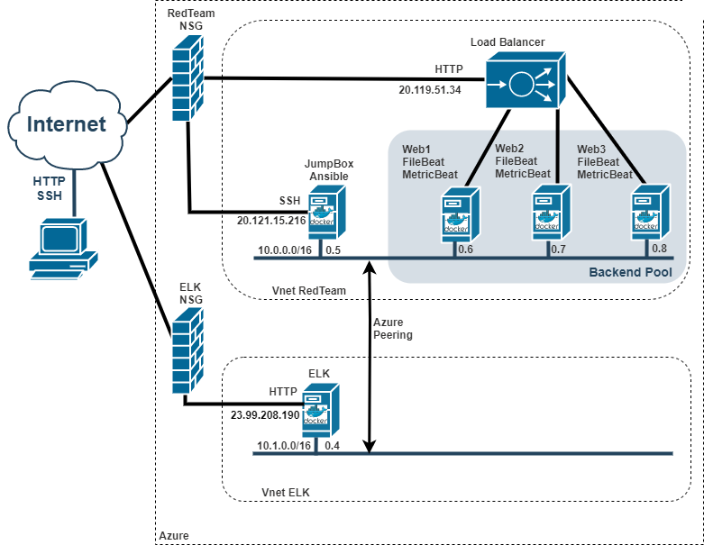

# ELK
Linux and Ansible scripts to deploy an ELK environment

## Automated ELK Stack Deployment

The files in this repository were used to configure the network illustrated below.



These files have been tested and used to generate a live ELK deployment on Azure. They can be used to either recreate the entire deployment pictured above. Alternatively, select portions of the Playbook file may be used to install only certain pieces of it, such as Filebeat.

```yaml
---
- name: Config Web VM with Docker
  hosts: webservers
  become: true
  tasks:
  - name: docker.io
    apt:
      force_apt_get: yes
      update_cache: yes
      name: docker.io
      state: present

  - name: Install pip3
    apt:
      force_apt_get: yes
      name: python3-pip
      state: present

  - name: Install Docker python module
    pip:
      name: docker
      state: present

  - name: download and launch a docker web container
    docker_container:
      name: dvwa
      image: cyberxsecurity/dvwa
      state: started
      restart_policy: always
      published_ports: 80:80

  - name: Enable docker service
    systemd:
      name: docker
      enabled: yes

```

This document contains the following details:
- Description of the Topology
- Access Policies
- ELK Configuration
  - Beats in Use
  - Machines Being Monitored
- How to Use the Ansible Build


### Description of the Topology

The main purpose of this network is to expose a load-balanced and monitored instance of DVWA, the D*mn Vulnerable Web Application.

#### Some of the highlight of the proposed implementation are:
- Load balancer ensures that the application will be highly scalable, fault tolerant and resilient against DDoS attacks, diverting traffic from the corporate network to a Cloud Provider.
- Load balancer increases the Availability of the network
- Using a JumbBox allows a fast deploy of the infrasture, using standarized scripts, repeteable and very scalable.

Integrating an ELK server allows users to easily monitor the vulnerable VMs for changes to the web server and system monitoring.
- Filebeat watch for changes on the log files: in particular server logs, and any web server log.
- Metricbeat record metric data from web servers, including operating system metrics such as CPU, memory and web server operating metrics.

The configuration details of each machine may be found below.

| Name     | Function                 | IP Address | Operating System |
|----------|--------------------------|------------|------------------|
| Jump Box | Ansible and admin Gateway| 10.0.0.5   | Linux With Docker|
| Web 1    | Web Server Pool Member   | 10.0.0.6   | Linux With Docker|
| Web 2    | Web Server Pool Member   | 10.0.0.7   | Linux With Docker|
| Web 3    | Web Server Pool Member   | 10.0.0.8   | Linux With Docker|
| ELK      | ELK Stack Server         | 10.1.0.4   | Linux With Docker|

### Access Policies

The machines on the internal network are not exposed to the public Internet. 

Only the ELK machine can accept connections from the Internet. Access to this machine is only allowed from the following IP addresses:
- 108.202.108.33

Machines within the network can only be accessed by jump from the JumpBox:
- Web1: 10.0.0.6
- Web2: 10.0.0.7
- Web3: 10.0.0.8
- ELK: 10.1.0.4

A summary of the access policies in place can be found in the table below.

| Name     | Publicly Accessible | Allowed IP Addresses | Protocol |
|----------|---------------------|----------------------|----------------------|
| Jump Box | Yes                 | 108.202.108.33       | SSH
| ELK      | Yes                 | 108.202.108.33       | HTTP
|          |                     |                      |

### Elk Configuration

```yaml
---
- name: Config Web VM with Docker
  hosts: elk
  remote_user: azureuser
  become: true
  tasks:

  - name: Install docker.io
    apt:
      force_apt_get: yes
      update_cache: yes
      name: docker.io
      state: present

  - name: Install pip3
    apt:
      force_apt_get: yes
      name: python3-pip
      state: present

  - name: Install Docker python module 
    pip:
      name: docker
      state: present

  - name: Setting sysctl max_map_count value
    sysctl: 
      name: vm.max_map_count 
      value: '262144'
      state: present
      reload: yes

  - name: Download and launch a docker elk container    
    docker_container:
      name: elk
      image: sebp/elk:761
      state: started
      restart_policy: always
      published_ports: 
        - 5601:5601
        - 9200:9200
        - 5044:5044

  - name: Enable docker service
    systemd:
      name: docker
      enabled: yes

  - name: Check docker is running
    systemd:
      state: started
      name: docker
```

Ansible was used to automate configuration of the ELK machine. No configuration was performed manually, which is advantageous because...
- Allows a fast deploy of the configuration, using standarized scripts, repeteable and very scalable.

The playbook implements the following tasks:
- Install Docker
- Install Python3
- Download and launch a docker elk container
- Enable docker service
- Check docker is running

The following screenshot displays the result of running `docker ps` after successfully configuring the ELK instance.


### Target Machines & Beats
This ELK server is configured to monitor the following machines:
- Web1: 10.0.0.6
- Web2: 10.0.0.7
- Web3: 10.0.0.8

We have installed the following Beats on these machines:
- FileBeat
- MetricBeat

These Beats allow us to collect the following information from each machine:
- Filebeat watch for changes on the log files: in particular server logs, and any web server log.
- Metricbeat record metric data from web servers, including operating system metrics such as CPU, memory and web server operating metrics.

### Using the Playbook
In order to use the playbook, you will need to have an Ansible control node already configured. Assuming you have such a control node provisioned: 

SSH into the control node and follow the steps below:
- Copy the SSH public key file to the target machine, on folder: \[user~\]/.ssh/authorized_keys
- Update the host file to include the ip of the target machine
- Run the playbook, verify it's execution, and navigate to the target machine to check that the installation worked as expected.

_TODO: Answer the following questions to fill in the blanks:_
- The install filebeat playbook is located on: 
- The install filebeat playbook is located on:  
- _Which file do you update to make Ansible run the playbook on a specific machine? How do I specify which machine to install the ELK server on versus which to install Filebeat on?_
- 
- _Which URL do you navigate to in order to check that the ELK server is running?

_As a **Bonus**, provide the specific commands the user will need to run to download the playbook, update the files, etc._
